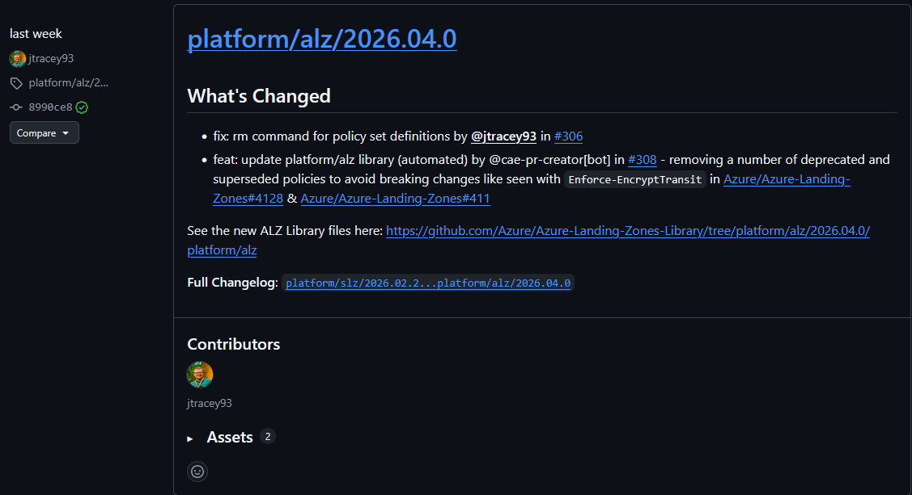

# T10 — K11 Livscykeluppdatering (forced library bump under production conditions)

**Test ID:** T10
**Criterion:** K11 Livscykeluppdatering
**Executed by:** Oskar
**Start date:** 2026-04-21
**End date:** _YYYY-MM-DD_
**Engine repo tag produced:** `_v0.3.0-lib-<version>_`
**Tenant:** Oskar test tenant (`3aadcd6c-3c4c-49bc-a9d5-57b7fbf31db7`)

---

## Metodologisk not — körningens kontext

Denna T10-körning genomfördes inte som en kontrollerad labbövning mot en ren baseline. Den
utfördes under realistiska driftsförhållanden: en brytande förändring i `Enforce-EncryptTransit`
hade orsakat upprepade misslyckade deploys på grund av en
case-sensitivity-bugg (`deny` vs `Deny`) som kvarstått över flera biblioteksversioner. När
uppströmsfixen landade i version `_2026.04.0_` tvingade produktionsbehovet fram en bump.

Denna körning används som K11-bevis eftersom scenariot är precis vad kriteriet avser mäta:
operatörens förmåga att absorbera uppströmsförändringar när de faktiskt inträffar, inte när man
har tid att iscensätta dem. Detta höjer den ekologiska validiteten jämfört med en fabricerad
bump, och skärper diskussionsmaterialet i kapitel 5.
Eftersom vi av andra skäl hade tagit bort deployment stacksen ur portalen var vi tvungna att få upp dom igen utan att uppdatera biblioteket. Vi lyckades hitta en fix genom att bara stänga av den policyn i vår deploy och gjorde denna fix till en tag som vi pekade alz-mgmt mot och körde en deploy. 
**Avgränsning:** Den planerade omställningen av `actionOnUnmanage` från `DetachAll` till
`DeleteAll` på styrningsstackarna har lyfts ut till **T10b** (separat körning, planerad nästa
mindre lib-patch) för att isolera DeleteAll-effekten från biblioteksbumpen. Detta är bättre
experimentdesign än att blanda två oberoende variabler i samma körning.

---

## Criterion reference

K11 — Livscykeluppdatering. Kumara et al. (2021) beskriver konfigurationsdrift som en
konsekvens av okoordinerade ändringar. Alonso et al. (2023) betonar att diskrepanser mellan kod
och infrastruktur undergräver IaC:s grundprinciper. Beetz och Harrer (2022) visar att
GitOps-mönstret möjliggör kontinuerlig konvergens mot önskat tillstånd — men detta förutsätter
att det önskade tillståndet i sig hålls aktuellt. T10 testar kriteriet genom att
ALZ-biblioteksversionen bumpas i engine-repot, uppdateringsverktyg körs, engine-repot taggas,
och en CD-pipeline deployar den uppdaterade konfigurationen mot en tenant. Deployment stacks
verifierar att nya definitioner tillkommer och att assignments som ändrats i uppströms
reflekteras i mål-tenantens tillstånd utan manuella ingrepp.

**Target library version:** `_2026.04.0_` (confirm on run day)
**Source library version:** `2025.09.2`

---

## Phase 0 — Pre-flight

### 0.1 Baseline health (degraded — dokumenteras ärligt)

- [x] Senaste CD-körning: **misslyckad** p.g.a. `Enforce-EncryptTransit` case-bugg
- [x] Kör CD igen med snabbfix för att få tillbaka deployment stacks
- [ ] Stackar med aktuell drift: _lista_
- [ ] `managementGroupExcludedPolicyAssignments: ['Enforce-EncryptTransit']` aktiv i tenant-repot

**Senaste misslyckade CD-körning URL:** _paste URL_
**Felmeddelande (utdrag):** _paste_

Att baselinen är i degraderat tillstånd är inte en brist i testuppsättningen — det är själva
anledningen till att K11-mekanismen behöver utvärderas. Dokumentera tillståndet som det är.

### 0.2 Release notes review

External release notes for target library version — screenshot the page som bevis på att
operatören konsulterat dokumentation innan absorption.



**Breaking changes identified (from release notes):**
- _paste_

**Specifically: `Enforce-EncryptTransit` case fix confirmation:**
- _paste relevant excerpt or screenshot reference_

**New policy sets / definitions of note:**
- _paste_

**Deprecated / removed policies:**
- _paste (cleanup kommer först i T10b när DeleteAll är aktivt; här dokumenteras att de
  detachas snarare än raderas)_

### 0.3 Baseline state snapshot *(kritisk — icke-förhandlingsbar)*

Utan denna snapshot finns ingen post-delta att rapportera.

```
.\scripts\Export-ALZStackState.ps1 -OutputFile .\state-snapshots\state-t10-baseline.json
```

**Baseline snapshot file:** `state-snapshots/state-t10-baseline.json`

**Baseline policy counts** (från Azure-portalen vid `alz` MG scope):

| Item                     | Count |
|--------------------------|-------|
| Policy definitions       |       |
| Policy set definitions   |       |
| Policy assignments       |       |
| Role definitions         |       |

**Baseline portal screenshots:**
- 
- 
- 

### 0.4 Arbetsomgångs-state i tenant-repot

Currently active in `alz-mgmt-oskar/config/core/governance/mgmt-groups/int-root.bicepparam`:

```bicep
managementGroupExcludedPolicyAssignments: ['Enforce-EncryptTransit']
```

Detta workaround togs in efter att `AKSIngressHttpsOnlyEffect` i `2025.09.2` accepterade
`["audit", "deny", "disabled"]` (gemener) medan den underliggande built-in-policyn krävde
TitleCase, vilket blockerade deploys. Målet med denna körning är bl.a. att kunna ta bort
workaroundet.

_Notes / observations:_

---

## Phase 1 — Commit 1: bump ALZ library version

### 1.1 Metadata bump

`templates/core/governance/tooling/alz_library_metadata.json`:

```diff
- "ref": "2025.09.2"
+ "ref": "_2026.04.0_"
```

### 1.2 Regenerate library

```powershell
cd templates/core/governance/lib
Remove-Item -Path ".\alz" -Recurse -Force

cd ../tooling
alzlibtool generate architecture "." alz --for-alz-bicep -o "../lib"
```

**alzlibtool output:**
```
<paste console output>
```

### 1.3 Update Bicep references

```powershell
.\Update-AlzLibraryReferences.ps1 -WhatIf
```


Then apply:
```powershell
.\Update-AlzLibraryReferences.ps1
```


### 1.4 Bug-fix verification *(avgörande för Phase 2)*

Kontrollera att case-buggen faktiskt är fixad i den regenererade biblioteksfilen innan
workaroundet tas bort.

`templates/core/governance/lib/alz/Enforce-EncryptTransit_20241211.alz_policy_set_definition.json`:

| Parameter                    | 2025.09.2 value          | New lib value      | Fixed? |
|------------------------------|--------------------------|--------------------|--------|
| `AKSIngressHttpsOnlyEffect`  | `["audit","deny","disabled"]` | _paste_            | Y / N  |

_Om lowercase kvarstår: hoppa över Phase 2 (behåll workaroundet), men fortsätt med Phase 3
evidence run. K11 passerar fortfarande så länge resten av biblioteksuppdateringen flyter
igenom — exclusionen stannar kvar och dokumenteras som en kvarvarande begränsning._

### 1.5 Git diff stats

```
git diff --stat
```
```
<paste git diff --stat output>
```

**Summary:**
- Files added to `lib/alz/`: _count_
- Files removed from `lib/alz/`: _count_
- `mgmt-groups/*/main.bicep` files modified: _count_

### 1.6 Commit

**SHA:** _paste_
**Message:** `chore: bump ALZ library 2025.09.2 -> _<new-version>_ (unblocks Enforce-EncryptTransit)`

Commit body:
```
<paste>
```

_Notes / observations:_

---

## Phase 2 — Commit 2 (tenant repo): remove EncryptTransit workaround

**Körs endast om Phase 1.4 bekräftat att buggen är fixad.**

### 2.1 Change

`alz-mgmt-oskar/config/core/governance/mgmt-groups/int-root.bicepparam`:

```diff
-  managementGroupDoNotEnforcePolicyAssignments: []
-  // Temporary workaround: 'Enforce-EncryptTransit' has a case-sensitivity bug in the ALZ library
-  // where the policy set sends effect 'deny' but the built-in policy definition requires 'Deny'.
-  // Remove this exclusion once the library is updated with the fix.
-  managementGroupExcludedPolicyAssignments: ['Enforce-EncryptTransit']
+  managementGroupDoNotEnforcePolicyAssignments: []
+  managementGroupExcludedPolicyAssignments: []
```

### 2.2 Commit

**SHA:** _paste_
**Message:** `fix: remove Enforce-EncryptTransit exclusion (case bug fixed in lib _<new-version>_)`

_Notes / observations:_

---

## Phase 3 — Evidence run

### 3.1 Engine repo PR och tag

**PR URL:** _paste_
**PR merged at:** _timestamp_

Tag:
```
git tag -a v0.3.0-lib-_<new-version>_ -m "ALZ library _<new-version>_"
git push origin v0.3.0-lib-_<new-version>_
```

**Tag URL:** _paste_


### 3.2 Tenant repo PR

Engine ref-bump till den nya taggen, plus commit från Phase 2.

**PR URL:** _paste_
**PR merged at:** _timestamp_

### 3.3 CD run (själva K11-bevisrundan)

**Run URL:** _paste_
**Result:** _green / red_
**Total duration:** _paste_

#### 3.3.1 CI what-if output *(kritiskt bevis)*

Förväntade adds: nya policy-definitions/sets från nya lib-versionen.
Förväntade modifies: policy assignments där TitleCase-fixen landade (inklusive
`Enforce-EncryptTransit` om Phase 2 utfördes).
Förväntade removes: detach av definitions som inte längre finns i lib (ingen radering i
denna körning — det är T10b).

```
<paste what-if output — fokusera på Apply: Governance-Intermediate Root och Apply: Governance-Landing Zones>
```


#### 3.3.2 Deployment stack execution log *(kritiskt bevis)*

Leta efter `Create: <resource>` (nya definitioner) och `Modify: <resource>` (uppdaterade
assignments). `DetachAll` innebär att borttagna resurser lämnas kvar orphaned — dokumentera
dessa som underlag för T10b.

```
<paste relevanta loggrader — filtrera på 'Create', 'Modify', 'Detach'>
```


### 3.4 Post-deploy state snapshot *(kritisk — icke-förhandlingsbar)*

```
.\scripts\Export-ALZStackState.ps1 -OutputPath .\state-snapshots\state-t10-after.json
.\scripts\Compare-ALZStackState.ps1 `
  -BaselinePath .\state-snapshots\state-t10-baseline.json `
  -CurrentPath .\state-snapshots\state-t10-after.json
```

**Diff summary:**
```
<paste Compare-ALZStackState output>
```

### 3.5 Post-deploy portal verification

| Item                     | Baseline | After | Delta |
|--------------------------|----------|-------|-------|
| Policy definitions       |          |       |       |
| Policy set definitions   |          |       |       |
| Policy assignments       |          |       |       |
| Role definitions         |          |       |       |


### 3.6 EncryptTransit policy healthy *(körningens primära produktionsmotivering)*

Om Phase 2 genomfördes — verifiera att policy set nu assignas rent utan felmeddelanden.


_Notes / observations:_

### 3.7 Minimum viable evidence — checklista

Om tiden är knapp, säkerställ åtminstone följande artefakter. Allt ovanför detta är
nice-to-have.

- [ ] **3.0** Baseline snapshot före bump (`state-t10-baseline.json`)
- [ ] **1.6** Commit SHA för bump
- [ ] **3.1** Engine repo tag URL
- [ ] **3.3** CD run URL + resultat
- [ ] **3.3.1** CI what-if screenshot
- [ ] **3.3.2** CD log screenshot som visar creates/modifies
- [ ] **3.4** Post-deploy snapshot (`state-t10-after.json`)
- [ ] **3.5** Portal-screenshots av assignments efter bump

---

## Phase 4 — Thesis mapping

### 4.1 Evidence → criterion mapping

| Evidence artifact                                | K11 aspect demonstrated                          |
|--------------------------------------------------|--------------------------------------------------|
| Release notes screenshot (0.2)                   | Operatör konsulterar extern ändringsdokumentation |
| Degraded baseline-dokumentation (0.1)            | K11:s nödvändighet manifesterad i produktionsdrift |
| `alz_library_metadata.json` diff (1.1)           | Single-point versionsdeklaration (code as source of truth) |
| `Update-AlzLibraryReferences.ps1` output (1.3)   | Verktygsunderstödd engine-repo-uppdatering       |
| CI what-if (3.3.1)                               | Plattformen förutsäger ändring före applicering  |
| CD stack log (3.3.2)                             | Deployment stacks auto-rekonfigurerar utan manuellt ingrepp |
| Before/after portal screenshots (0.3 vs 3.5)     | Drift mellan kod och infrastruktur resolverad    |
| Tenant workaround borttaget (2.1)                | Lokal drift orsakad av uppströmsbugg remedierad av uppströmsuppdatering |

### 4.2 Result vs criterion

- [ ] Library version successfully bumped in engine repo
- [ ] `alzlibtool` regenerated the lib without manual edits
- [ ] `Update-AlzLibraryReferences.ps1` updated Bicep references automatically
- [ ] Engine repo tagged
- [ ] CD pipeline deployed the update to the tenant without manual stack-state edits
- [ ] New policy definitions were added to the `alz` MG automatically
- [ ] Previously-blocking policy (`Enforce-EncryptTransit`) now deploys cleanly
- [ ] Local workaround retired (om Phase 2 utfördes)

**Criterion verdict:** _Passed / Partially passed / Not passed_

**Justification (1–2 stycken, akademisk svenska för kapitel 4):**

> _paste när skrivs upp — lyft fram att körningen gjordes under reell driftspress, att bumpen
> var forcerad av en brytande förändring, och att K11-mekanismen (tooling + deployment
> stacks + tagging) hanterade övergången utan manuella tillståndsedit._

### 4.3 Findings för kapitel 5 (diskussion / begränsningar)

**Finding 1: Uppströmsbugg kvarstod över flera biblioteksversioner.**
`Enforce-EncryptTransit` bar ett gemener-default-värde för `deny` som kolliderade med den
underliggande built-in-policyns TitleCase-krav. Detta krävde ett lokalt workaround i
tenant-repot för att kringgå assignmenten. T10-körningen visade att livscykeluppdatering inte
är en rent teknisk övning — operatören måste också spåra om tidigare lokala workarounds nu kan
retireras. Detta stämmer överens med operatör-som-förändringsabsorbent-modellen som K11
mäter, men illustrerar också gränsen för vad en operatör kan göra när problemet ligger
uppströms: väntan på extern fix är enda alternativet till att forka biblioteket.

**Finding 2: Forcerad bump under driftspress validerar K11-mekanismen starkare än planerad.**
Körningen genomfördes efter att upprepade misslyckade deploys blockerats av uppströmsbuggen.
Att biblioteksbumpen och påföljande tenant-deploy i detta läge flöt igenom utan manuella
tillståndsedit, och att workaroundet kunde retireras i samma körning, demonstrerar att
K11-mekanismen fungerar under den typ av förhållanden Alonso et al. (2023) och Kumara et al.
(2021) beskriver som drift-genererande. En iscensatt bump mot en ren baseline hade inte
exponerat samma egenskaper.

**Finding 3: `DetachAll` som default — deferred till T10b.**
Microsofts ALZ-dokumentation beskriver automatisk rensning av deprekerade policies som en
egenskap hos deployment stacks vid `ActionOnUnmanage: DeleteAll`. Den bootstrappade
`cd-template.yaml` kommer med `DetachAll` på samtliga 16 stackar som default. Denna gap
mellan dokumentation och default-konfiguration testas separat i **T10b** (planerad nästa
patch-bump) för att isolera DeleteAll-effekten från bibliotekets innehållsändringar.

**Finding 4 (om någon):** _paste_

### 4.4 Scope boundary — vad T10 INTE testade

- **`DetachAll` → `DeleteAll` omställning** (flyttat till T10b — separat körning med
  isolerad variabel)
- **AVM modulversions-bumpar** (deferred till T10c för attributionsklarhet — samma
  livscykel­mekanism, samma CI/CD-väg, ej exekverat i denna körning)
- **Breaking-change-scenarier där biblioteket tar bort en policy med aktiva non-compliant
  resurser** (skulle kräva fabricerat scenario; ingår inte i K11)
- **Rollback-väg** (återgång till föregående biblioteksversion) — ej krävd av K11-formulering
  men värd att nämna som begränsning

---

## Appendix A — Command reference

```powershell
# Baseline snapshot (kritisk)
.\scripts\Export-ALZStackState.ps1 -OutputPath .\state-snapshots\state-t10-baseline.json

# Library regeneration
cd templates/core/governance/lib
Remove-Item -Path ".\alz" -Recurse -Force
cd ../tooling
alzlibtool generate architecture "." alz --for-alz-bicep -o "../lib"

# Reference update
.\Update-AlzLibraryReferences.ps1 -WhatIf
.\Update-AlzLibraryReferences.ps1

# Post-deploy snapshot + diff (kritisk)
.\scripts\Export-ALZStackState.ps1 -OutputPath .\state-snapshots\state-t10-after.json
.\scripts\Compare-ALZStackState.ps1 `
  -BaselinePath .\state-snapshots\state-t10-baseline.json `
  -CurrentPath .\state-snapshots\state-t10-after.json

# Tag engine repo
git tag -a v0.3.0-lib-<new-version> -m "ALZ library <new-version>"
git push origin v0.3.0-lib-<new-version>
```

## Appendix B — Screenshot filename convention

Lagras under `docs/screenshots/` i engine-repot:

- `t10-release-notes.png`
- `t10-baseline-definitions.png`
- `t10-baseline-assignments-introot.png`
- `t10-baseline-assignments-lz.png`
- `t10-updater-whatif.png`
- `t10-updater-apply.png`
- `t10-engine-tag.png`
- `t10-whatif-introot.png`
- `t10-whatif-lz.png`
- `t10-cd-creates.png`
- `t10-after-definitions.png`
- `t10-after-assignments-introot.png`
- `t10-after-assignments-lz.png`
- `t10-encrypttransit-healthy.png`

## Appendix C — T10b placeholder (DeleteAll-omställning)

Separat testprotokoll skapas när nästa patch-version av ALZ-biblioteket släpps. T10b isolerar
`actionOnUnmanage: DetachAll → DeleteAll`-omställningen på de 14 styrningsstackarna (rader
565, 584, 602, 620, 639, 658, 678, 697, 716, 735, 753, 772, 790, 808 i `cd-template.yaml`;
rad 827 networking och rad 846 logging lämnas som `DetachAll`). Förväntat resultat: orphaned
resurser från T10 städas upp automatiskt vid nästa CD-körning, vilket ger direkt bevis på
auto-cleanup-mekanismen utan att blandas med biblioteksinnehåll­ets ändringar.